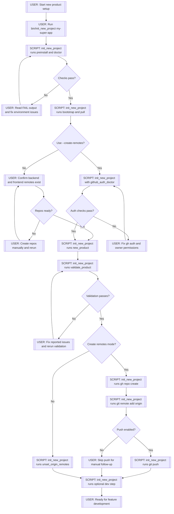
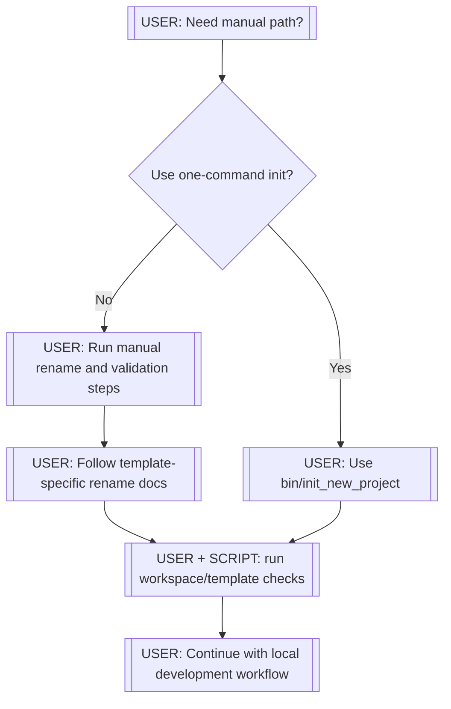

# Getting Started

This guide covers the fastest path to bootstrap a new product from templates and the manual rename tools when needed.

## Before You Start

Validation:

1. Run `bin/preinstall` and `bin/doctor`.
2. If it reports failures, fix the provided errors and run it again.
3. Continue only after `bin/doctor` succeeds.

Repeatability:

1. Safe to run repeatedly.
2. If environment changes (Ruby, Docker, auth), re-run before continuing.

## Recommended Path: One-Command Bootstrap

## New App Setup Flow

Legend:

- `[USER]` means a manual decision or action by the operator.
- `[SCRIPT: <name>]` means the step is handled by automation in that utility script.





Command:

```bash
bin/init_new_project my-super-app
```

What this does:

1. Runs prechecks (`preinstall`, `doctor`).
2. Clones/bootstraps dependencies and updates repos (`bootstrap`, `pull`).
3. Uses one of two remote workflows:
	- manual mode (default): prompts to confirm backend/frontend remotes already exist.
	- automated mode (`--create-remotes`): verifies GitHub permissions, creates remotes with selected visibility, sets local origins, and optionally pushes.
4. Runs template rename orchestration (`new_product`).
5. Runs post-rename validation (`validate_product`).
6. Configures git remotes:
	- manual mode: unsets template `origin` remotes and prints add-remote hints.
	- automated mode: points local repos to newly created product remotes.
7. Pushes to remotes when automated mode is enabled (unless `--no-push` is used).
8. Optionally launches local dev services.

Messages to watch for:

0. Give the messages a scan on first run. Some are informational about options or next steps. Some are warnings or failures that require your attention.
1. Anything starting with `[FAIL]`, you should read those messages and fix the underlying issue before continuing. They attempt to be actionable.
2. Check for `[WARN]`, these will inform you of attempted actions or decisions that require your attention. They may not be fatal such as if Postgres is already running, that port may be occupied. Or Postgres may not be visible to the scripts if you run it in Docker in your projects and the containers are not running.


Validation after command:

1. Before first production deploy (not required for local dev), set API CORS origins (`CORS_ALLOWED_ORIGINS`) in your platform env config (PaaS) or in the app `.env` used by your deploy/runtime, and follow `repos/api-template/docs/deploy/production-cors-setup.md`.
2. Run `bin/ci` in the API repo and `npm run lint && npm run test && npm run build` in the web repo.
3. Run `bin/start-day` to launch local dev services and verify the app is running. Works best when respository workspaces are clean and up to date. If you have uncommitted changes, stash or commit them first.
4. If that all works, you are ready to start development.

## Alternative: Manual Rename + Validate Steps

1. Rename tools may be used independently if you want to run them manually. See instructions in respective repos for intended usage.

## Remote Setup After Bootstrap

After `init_new_project`, origin remotes are unset to avoid accidental pushes to template repositories.

Use printed commands from the init output, then verify:

```bash
git -C . remote -v
git -C repos/my-super-app-api remote -v
git -C repos/my-super-app-web remote -v
```

Expected result:

1. Each repository points to your own project location.
