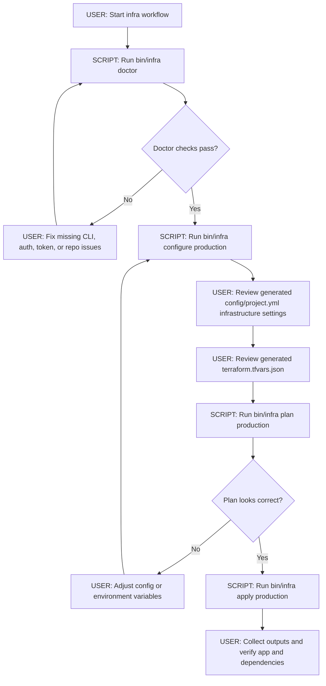
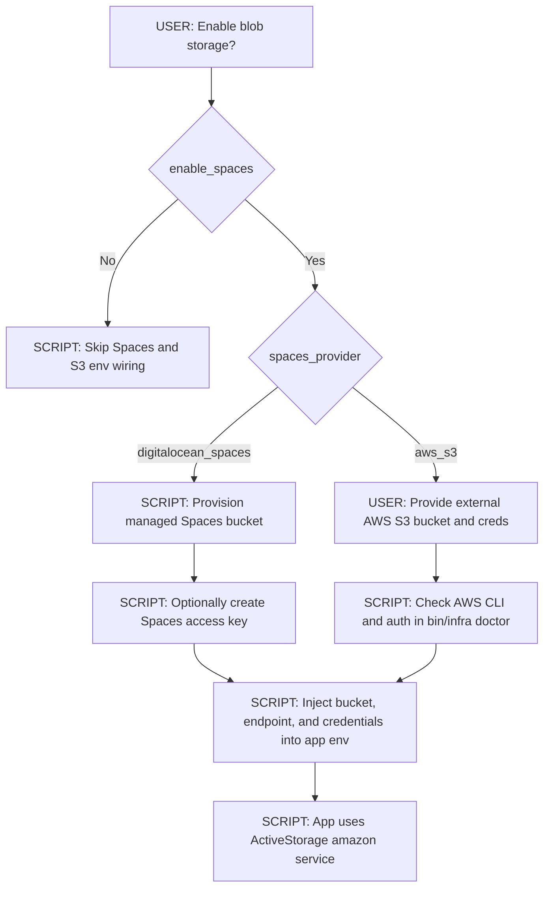

# DigitalOcean Terraform Notes

## Infra Setup and Deploy Flow

Legend:

- `[USER]` means a manual action or decision.
- `[SCRIPT: <name>]` means the step is automated by a workspace utility script.



## Blob Store Decision Tree



## Postgres behavior

- When `enable_postgres = true`, Terraform creates a managed PostgreSQL cluster, app database, and app user.
- The resulting connection URL is exposed only as a sensitive output (`database_url`).
- App Platform gets `DATABASE_URL` from managed Postgres automatically via root module wiring.

## OpenSearch behavior

- OpenSearch is optional but enabled by default (`enable_opensearch = true`).
- Default OpenSearch engine target is version `3`, which is compatible with current Searchkick releases.
- When enabled, Terraform creates a managed OpenSearch cluster and exposes its URL as a sensitive output.
- App Platform gets `OPENSEARCH_URL` from managed OpenSearch automatically when enabled.
- When disabled, the stack falls back to `opensearch_url` if one is provided explicitly.

## Spaces and S3 behavior

- Blob storage support is enabled by default (`enable_spaces = true`).
- `spaces_provider = "digitalocean_spaces"` provisions a Spaces bucket and Spaces access key by default.
- Provide application Spaces creds with Terraform vars `app_spaces_access_key_id` and `app_spaces_secret_access_key`.
- When Terraform manages a Spaces bucket (`manage_spaces_bucket = true`), also provide provider creds with `spaces_provider_access_key_id` and `spaces_provider_secret_access_key`.
- If you prefer environment variables instead of tfvars files, use Terraform variable env names: `TF_VAR_app_spaces_access_key_id`, `TF_VAR_app_spaces_secret_access_key`, `TF_VAR_spaces_provider_access_key_id`, and `TF_VAR_spaces_provider_secret_access_key`.
- `spaces_provider = "aws_s3"` skips provisioning and uses provided values:
	- `data_artifact_bucket`
	- `aws_access_key_id`
	- `aws_secret_access_key`
	- optional `s3_endpoint` (typically not needed for AWS S3)
- App Platform receives these env vars when present:
	- `ACTIVE_STORAGE_SERVICE` (defaults to `amazon` when spaces are enabled)
	- `DATA_ARTIFACT_BUCKET`
	- `S3_ENDPOINT`
	- `AWS_ACCESS_KEY_ID`
	- `AWS_SECRET_ACCESS_KEY`

## Infra CLI

- `bin/workspace infra doctor`
	- Checks terraform/tofu, doctl, gh, git, DO token, doctl auth, gh auth, and expected repos.
- `bin/workspace infra configure production`
	- Prompts for core app/infra values.
	- Updates `config/project.yml` environment infrastructure and writes `infra/digitalocean_v2/terraform.tfvars.json`.
- `bin/workspace infra plan production` and `bin/workspace infra apply production`
	- Run terraform init then selected action using generated tfvars.

## Emergency DigitalOcean Resource Destruction

These DigitalOcean commands are **not** part of normal day-to-day infra operations.
Use them only when resources are stuck and you want to destroy everything (EVERYTHING, DATA INCLUDED) in some kind of initial test launch. (for example, Terraform can no longer destroy a dependency cleanly bc you deleted TF references to it or edited TF and it doesn't work normally anymore).
These are dangerous tools and you are responsible for understanding the consequences of running them. Use at your own risk. We are not responsible for any data loss or downtime caused by running these commands.

- Inventory matching DigitalOcean resources before destructive actions:
	- `bin/workspace infra digitalocean resources --environment=production`
- Purge matching resources (destructive emergency command):
	- `bin/workspace infra digitalocean purge --environment=production`
	- `bin/workspace infra digitalocean purge --environment=production --confirm-project=my-super-app --yes`

Scope note:

- Purge targets the DigitalOcean project resolved from the selected `--environment` and deletes that project plus matched app/database resources and the configured Spaces bucket.
- In the standard one-project-per-environment setup, this is effectively a full teardown of that environment's managed DigitalOcean resources.

Safety guidance:

- Avoid running purge against already-live applications unless you are intentionally tearing down that environment. It will tear everything down. Your whole app will be gone.
- Purge now requires an explicit destructive confirmation (`type yes` interactively, or `--yes` for non-interactive execution).
- The purge flow uses force/non-interactive deletion flags after confirmation so it does not repeatedly stop for additional prompts.
- Known DigitalOcean Spaces caveat: bucket deletion can be queued for a long period; while queued, the bucket name cannot be reused. This can cause both Terraform and emergency purge workflows to fail when trying to immediately re-provision with the same bucket name.

## Launch Guide

Recommended production flow:

1. `bin/workspace infra doctor` (checks required CLIs, auth state, token presence, expected repos, and blob-store readiness prerequisites)
2. `bin/workspace infra configure production` (guides config prompts and writes project manifest infrastructure plus `terraform.tfvars.json`)
3. `bin/workspace infra plan production` (runs terraform init and previews infrastructure changes before apply)
4. `bin/workspace infra apply production` (runs terraform init/apply to provision and wire configured infrastructure resources)

Example command sequence:

```bash
bin/workspace infra doctor
bin/workspace infra configure production
bin/workspace infra plan production
bin/workspace infra apply production
```

- The current `bin/workspace infra` command set supports `doctor`, `configure`, `plan`, and `apply`.
- A dedicated `bin/workspace infra deploy production` command is not implemented yet.
- For now, treat `apply` as the launch/provision step, then use your App Platform deploy flow (auto-deploy from configured repo branch or `doctl apps update --update-sources`) as needed.

## Security guidance

- Terraform state may contain secrets. Use remote encrypted state before production rollout.
- Never commit `.terraform/`, `terraform.tfstate*`, or `terraform.tfvars*` files.
- Keep `DIGITALOCEAN_ACCESS_TOKEN` outside repo files (shell env, direnv, or secret manager).
- Restrict access to Terraform state and rotate credentials if exposed.
